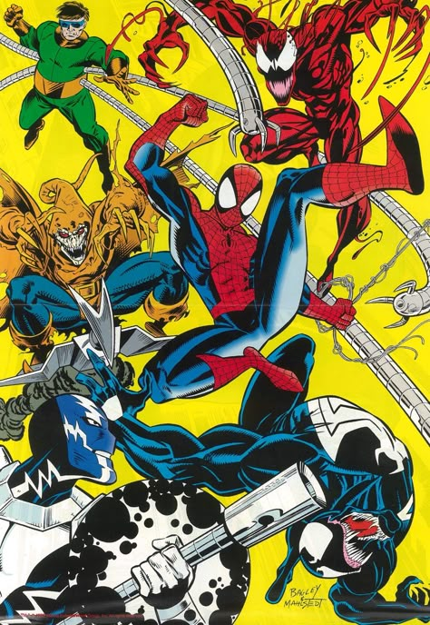

<table align="center">
<tr>
<td align="center" valign="middle" width="70%">
<h2>Olá, olá! 👋</h2>
<h3>Eu sou Otávio Vianna Lima, desenvolvedor e designer ✦</h3>
 

🎓 Desenvolvimento de Software Multiplataforma — Fatec SJC

💻 Full Stack • Designer • DevOps

📚 Estudando Blender e .NET

🎮 My Chemical Romance • Homem-Aranha • Persona • tgswiiwagaa

 

</td>
<td align="center" valign="middle" width="30%">

</td>
</tr>
</table>
